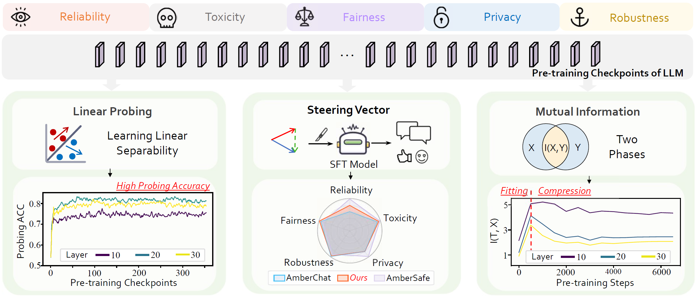

<!-- <p align="center">
  
</p> -->


### <div align="center">Towards Tracing Trustworthiness Dynamics: Revisiting Pre-training Period of Large Language Models<div> 

<div align="center">
<a href="https://arxiv.org/abs/2402.19465"></a> &ensp;
</div>


## 😃 Introduction
We are excited to present "Towards Tracing Trustworthiness Dynamics: Revisiting Pre-training Period of Large Language Models," a pioneering study on exploring trustworthiness in LLMs during pre-training. 
We explores five key dimensions of trustworthiness: reliability, privacy, toxicity, fairness, and robustness. 
By employing linear probing and extracting steering vectors from LLMs' pre-training checkpoints, the study aims to uncover the potential of pre-training in enhancing LLMs' trustworthiness. Furthermore, we investigates the dynamics of trustworthiness during pre-training through mutual information estimation, observing a two-phase phenomenon: fitting and compression. 
Our findings unveil new insights and encourage further developments in improving the trustworthiness of LLMs from an early stage.





##  🚩Features

We want to **ANSWER**: 

- How LLMs dynamically encode trustworthiness during pre-trainin?
- How to harness the pre-training period for more trustworthy LLMs?

We **FIND** that:

- After the early pre-training period, middle layer representations of LLMs have already developed *linearly separable patterns* about trustworthiness.
- Steering vectors extracted from pre-training checkpoints could *promisingly enhance the SFT model’s trustworthiness*.
- During the pretraining period of LLMs, there exist two distinct phases regarding trustworthiness: *fitting and compression*.

## 🚀Getting Started

### 💻Prerequisites

### 🔧Installation

### 🌟Usage

## 💪To-Do List
We are currently organizing the code for TracingLLM. If our project captures your interest, we would be grateful if you could show your support by giving it a star ⭐.

## 📝License
Distributed under the Apache-2.0 License. See LICENSE for more information.

## 📖BibTeX
```
@misc{qian2024tracing,
      title={Towards Tracing Trustworthiness Dynamics: Revisiting Pre-training Period of Large Language Models}, 
      author={Chen Qian and Jie Zhang and Wei Yao and Dongrui Liu and Zhenfei Yin and Yu Qiao and Yong Liu and Jing Shao},
      year={2024},
      eprint={2402.19465},
      archivePrefix={arXiv},
      primaryClass={cs.CL}
}
